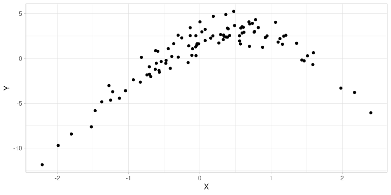
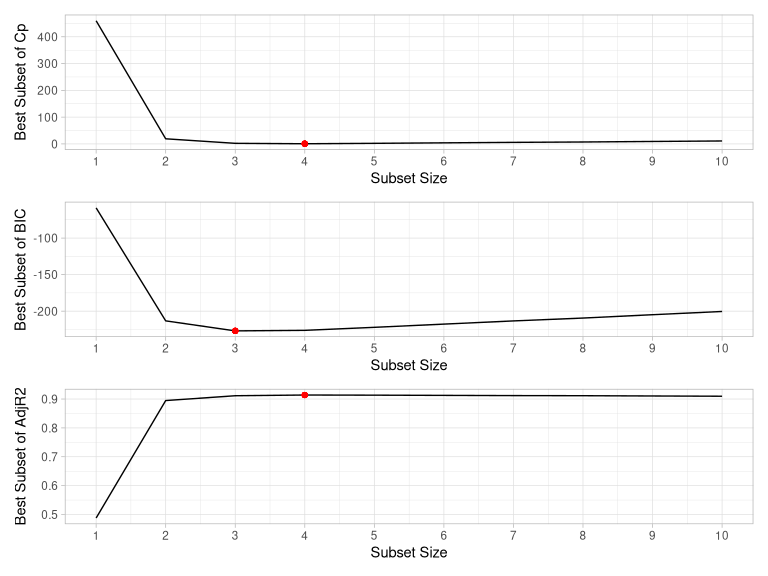
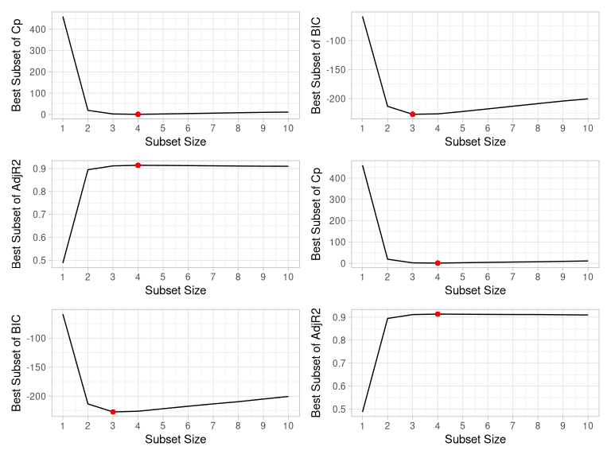
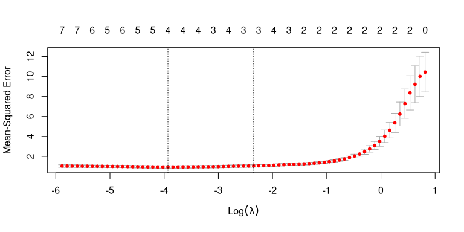
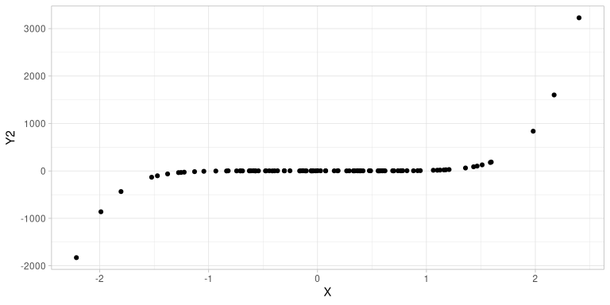
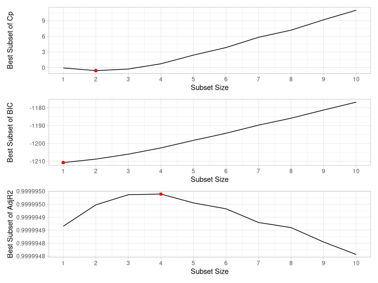

Chapter 6: Linear Model Selection and Regularisation
================
Alfredo Hernández -
10 April 2018

# Exercise 8

In this exercise, we will generate simulated data, and will then use
this data to perform best subset selection.

1.  Use the `rnorm()` function to generate a predictor *X* of length
    *n* = 100, as well as a noise vector *ϵ* of length *n* = 100.

2.  Generate a response vector *Y* of length *n* = 100 according to the
    model
    *Y* = *β*<sub>0</sub> + *β*<sub>1</sub>*X* + *β*<sub>2</sub>*X*<sup>2</sup> + *β*<sub>3</sub>*X*<sup>3</sup> + *ϵ*,

where *β*<sub>0</sub>, *β*<sub>1</sub>, *β*<sub>2</sub>, and
*β*<sub>3</sub> are constants of your choice.

1.  Use the `regsubsets()` function to perform best subset selection in
    order to choose the best model containing the predictors
    *X*, *X*<sup>2</sup>, …, *X*<sup>10</sup>. What is the best model
    obtained according to *C*<sub>*p*</sub>, *B**I**C*, and adjusted
    *R*<sup>2</sup>? Show some plots to provide evidence for your
    answer, and report the coefficients of the best model obtained.

2.  Repeat (c), using forward stepwise selection and also using
    backwards stepwise selection. How does your answer compare to the
    results in (c)?

3.  Now fit a Lasso model to the simulated data, again using
    *X*, *X*<sup>2</sup>, …, *X*<sup>10</sup> as predictors. Use
    cross-validation to select the optimal value of *λ*. Create plots of
    the cross-validation error as a function of *λ*. Report the
    resulting coefficient estimates, and discuss the results obtained.

4.  Now generate a response vector *Y* according to the model

*Y* = *β*<sub>0</sub> + *β*<sub>7</sub>*X*<sup>7</sup> + *ϵ*,

and perform best subset selection and the Lasso. Discuss the results
obtained.

<!-- ## Answers -->

## Exercise 8 (a)

To be consistent with our results, we need to set a seed first:

``` r
set.seed(1)
```

Now we define the predictor *X* and the noise *ϵ*:

``` r
X <- rnorm(100)
epsilon <- rnorm(100)
```

## Exercise 8 (b)

First of all, we define our *β* coefficients:

``` r
beta0 <- 2
beta1 <- 3
beta2 <- -2
beta3 <- -0.3
```

Now we define our *Y* response:

``` r
Y <- beta0 + beta1 * X + beta2 * X^2 + beta3 * X^3 + epsilon
```

We can see our function below:

``` r
ggplot(data = tibble(X, Y)) +
  geom_point(aes(x = X, y = Y))
```



## Exercise 8 (c)

We need the `leaps` package to use the `regsubsets()` function:

``` r
library(leaps)
```

Now we use `regsubsets()` to select best model having a polynomial of
*X* of degree 10:

``` r
mod.full <- regsubsets(Y ~ poly(X, 10, raw = T),
  data = tibble(Y, X),
  nvmax = 10
)
```

Note that we use the `poly()` function with the `raw = TRUE` option to
use raw polynomials instead of orthogonal ones.

Now we can get the summary of the best selection using an exhaustive
algorithm (the default method of `regsubsets()`):

``` r
(mod.summary <- summary(mod.full))[["outmat"]]
```

    ##           poly(X, 10, raw = T)1 poly(X, 10, raw = T)2 poly(X, 10, raw = T)3
    ## 1  ( 1 )  " "                   "*"                   " "                  
    ## 2  ( 1 )  "*"                   "*"                   " "                  
    ## 3  ( 1 )  "*"                   "*"                   "*"                  
    ## 4  ( 1 )  "*"                   "*"                   "*"                  
    ## 5  ( 1 )  "*"                   "*"                   "*"                  
    ## 6  ( 1 )  "*"                   "*"                   "*"                  
    ## 7  ( 1 )  "*"                   "*"                   "*"                  
    ## 8  ( 1 )  "*"                   "*"                   "*"                  
    ## 9  ( 1 )  "*"                   "*"                   "*"                  
    ## 10  ( 1 ) "*"                   "*"                   "*"                  
    ##           poly(X, 10, raw = T)4 poly(X, 10, raw = T)5 poly(X, 10, raw = T)6
    ## 1  ( 1 )  " "                   " "                   " "                  
    ## 2  ( 1 )  " "                   " "                   " "                  
    ## 3  ( 1 )  " "                   " "                   " "                  
    ## 4  ( 1 )  " "                   "*"                   " "                  
    ## 5  ( 1 )  " "                   "*"                   "*"                  
    ## 6  ( 1 )  " "                   " "                   " "                  
    ## 7  ( 1 )  " "                   "*"                   "*"                  
    ## 8  ( 1 )  "*"                   " "                   "*"                  
    ## 9  ( 1 )  "*"                   "*"                   "*"                  
    ## 10  ( 1 ) "*"                   "*"                   "*"                  
    ##           poly(X, 10, raw = T)7 poly(X, 10, raw = T)8 poly(X, 10, raw = T)9
    ## 1  ( 1 )  " "                   " "                   " "                  
    ## 2  ( 1 )  " "                   " "                   " "                  
    ## 3  ( 1 )  " "                   " "                   " "                  
    ## 4  ( 1 )  " "                   " "                   " "                  
    ## 5  ( 1 )  " "                   " "                   " "                  
    ## 6  ( 1 )  "*"                   "*"                   "*"                  
    ## 7  ( 1 )  " "                   "*"                   " "                  
    ## 8  ( 1 )  " "                   "*"                   "*"                  
    ## 9  ( 1 )  " "                   "*"                   "*"                  
    ## 10  ( 1 ) "*"                   "*"                   "*"                  
    ##           poly(X, 10, raw = T)10
    ## 1  ( 1 )  " "                   
    ## 2  ( 1 )  " "                   
    ## 3  ( 1 )  " "                   
    ## 4  ( 1 )  " "                   
    ## 5  ( 1 )  " "                   
    ## 6  ( 1 )  " "                   
    ## 7  ( 1 )  "*"                   
    ## 8  ( 1 )  "*"                   
    ## 9  ( 1 )  "*"                   
    ## 10  ( 1 ) "*"

Now we find the model or subset size for the best *C*<sub>*p*</sub>,
*B**I**C*, and adjusted *R*<sup>2</sup> coefficients:

``` r
min.cp <- which.min(mod.summary$cp)
min.bic <- which.min(mod.summary$bic)
max.adjr2 <- which.max(mod.summary$adjr2)
```

Let us remember that the previous coefficients are defined as follows:
$$
C\_{p} = \\frac{1}{n} (\\text{RSS} + 2d \\hat{\\sigma}^{2}), \\quad
BIC = \\frac{1}{n} (\\text{RSS} + \\log(n) d \\hat{\\sigma}^{2}), \\quad
\\text{Adj} R^{2} = 1 - \\frac{\\text{RSS}/(n-d-1)}{\\text{TSS}/(n-1)},
$$
where TSS = ∑(*y*<sub>*i*</sub> − *ȳ*)<sup>2</sup> is the total sum of
squares.

Now we define a `ggplot2` function to simplify the process of exploring
the results:

``` r
plot_statistics <- function(summary, stat, opt.stat, title.str = NULL) {
  variable <- summary[[tolower(stat)]]

  gg <- ggplot(tibble(x = seq_along(variable), y = variable)) +
    geom_line(aes(x = x, y = y)) +
    geom_point(aes(x = opt.stat, y = variable[opt.stat]), colour = "red") +
    scale_x_continuous(breaks = seq(1:10)) +
    labs(x = "Subset Size", y = paste("Best Subset of", stat))

  if (!is.null(title.str)) {
    gg <- gg + labs(title = title.str)
  }

  return(gg)
}
```

Now we compare the three statistics as a function of the subset size:

``` r
patchwork::wrap_plots(
  plot_statistics(mod.summary, "Cp", min.cp),
  plot_statistics(mod.summary, "BIC", min.bic),
  plot_statistics(mod.summary, "AdjR2", max.adjr2)
) +
  patchwork::plot_layout(nrow = 3, guides = "collect")
```



As we can see from the results, with *C*<sub>*p*</sub>, *B**I**C*, and
adjusted *R*<sup>2</sup> criteria, 4, 3, 4-variable models are picked,
respectively. The expression for this 4-variable and 3-variable model
are the following, respectively:

``` r
# 4-variable model
coefficients(mod.full, id = min.cp)
```

    ##           (Intercept) poly(X, 10, raw = T)1 poly(X, 10, raw = T)2 
    ##            2.07200775            3.38745596           -2.15424359 
    ## poly(X, 10, raw = T)3 poly(X, 10, raw = T)5 
    ##           -0.74202574            0.08072292

``` r
# 3-variable model
coefficients(mod.full, id = min.bic)
```

    ##           (Intercept) poly(X, 10, raw = T)1 poly(X, 10, raw = T)2 
    ##             2.0615072             2.9752803            -2.1237910 
    ## poly(X, 10, raw = T)3 
    ##            -0.2823614

As we can see, the *B**I**C* statistic selects the correct
*β*<sub>0</sub> + *β*<sub>1</sub>*X* + *β*<sub>2</sub>*X*<sup>2</sup> + *β*<sub>3</sub>*X*<sup>3</sup>
model, whilst the *C*<sub>*p*</sub> and adjusted *R*<sup>2</sup>
statistics additionally pick *X*<sup>5</sup>.

## Exercise 8 (d)

First of all, we need to fit forward and backward stepwise models to the
data using the `regsubsets()` specifying the desired method:

``` r
mod.fwd <- regsubsets(Y ~ poly(X, 10, raw = T),
  data = tibble(Y, X),
  nvmax = 10,
  method = "forward"
)
mod.bwd <- regsubsets(Y ~ poly(X, 10, raw = T),
  data = tibble(Y, X),
  nvmax = 10,
  method = "backward"
)
```

Now we can get the summary of the best selection using both models:

``` r
(fwd.summary <- summary(mod.fwd))[["outmat"]]
```

    ##           poly(X, 10, raw = T)1 poly(X, 10, raw = T)2 poly(X, 10, raw = T)3
    ## 1  ( 1 )  " "                   "*"                   " "                  
    ## 2  ( 1 )  "*"                   "*"                   " "                  
    ## 3  ( 1 )  "*"                   "*"                   "*"                  
    ## 4  ( 1 )  "*"                   "*"                   "*"                  
    ## 5  ( 1 )  "*"                   "*"                   "*"                  
    ## 6  ( 1 )  "*"                   "*"                   "*"                  
    ## 7  ( 1 )  "*"                   "*"                   "*"                  
    ## 8  ( 1 )  "*"                   "*"                   "*"                  
    ## 9  ( 1 )  "*"                   "*"                   "*"                  
    ## 10  ( 1 ) "*"                   "*"                   "*"                  
    ##           poly(X, 10, raw = T)4 poly(X, 10, raw = T)5 poly(X, 10, raw = T)6
    ## 1  ( 1 )  " "                   " "                   " "                  
    ## 2  ( 1 )  " "                   " "                   " "                  
    ## 3  ( 1 )  " "                   " "                   " "                  
    ## 4  ( 1 )  " "                   "*"                   " "                  
    ## 5  ( 1 )  " "                   "*"                   "*"                  
    ## 6  ( 1 )  " "                   "*"                   "*"                  
    ## 7  ( 1 )  " "                   "*"                   "*"                  
    ## 8  ( 1 )  " "                   "*"                   "*"                  
    ## 9  ( 1 )  " "                   "*"                   "*"                  
    ## 10  ( 1 ) "*"                   "*"                   "*"                  
    ##           poly(X, 10, raw = T)7 poly(X, 10, raw = T)8 poly(X, 10, raw = T)9
    ## 1  ( 1 )  " "                   " "                   " "                  
    ## 2  ( 1 )  " "                   " "                   " "                  
    ## 3  ( 1 )  " "                   " "                   " "                  
    ## 4  ( 1 )  " "                   " "                   " "                  
    ## 5  ( 1 )  " "                   " "                   " "                  
    ## 6  ( 1 )  " "                   " "                   "*"                  
    ## 7  ( 1 )  "*"                   " "                   "*"                  
    ## 8  ( 1 )  "*"                   "*"                   "*"                  
    ## 9  ( 1 )  "*"                   "*"                   "*"                  
    ## 10  ( 1 ) "*"                   "*"                   "*"                  
    ##           poly(X, 10, raw = T)10
    ## 1  ( 1 )  " "                   
    ## 2  ( 1 )  " "                   
    ## 3  ( 1 )  " "                   
    ## 4  ( 1 )  " "                   
    ## 5  ( 1 )  " "                   
    ## 6  ( 1 )  " "                   
    ## 7  ( 1 )  " "                   
    ## 8  ( 1 )  " "                   
    ## 9  ( 1 )  "*"                   
    ## 10  ( 1 ) "*"

``` r
(bwd.summary <- summary(mod.bwd))[["outmat"]]
```

    ##           poly(X, 10, raw = T)1 poly(X, 10, raw = T)2 poly(X, 10, raw = T)3
    ## 1  ( 1 )  " "                   "*"                   " "                  
    ## 2  ( 1 )  "*"                   "*"                   " "                  
    ## 3  ( 1 )  "*"                   "*"                   "*"                  
    ## 4  ( 1 )  "*"                   "*"                   "*"                  
    ## 5  ( 1 )  "*"                   "*"                   "*"                  
    ## 6  ( 1 )  "*"                   "*"                   "*"                  
    ## 7  ( 1 )  "*"                   "*"                   "*"                  
    ## 8  ( 1 )  "*"                   "*"                   "*"                  
    ## 9  ( 1 )  "*"                   "*"                   "*"                  
    ## 10  ( 1 ) "*"                   "*"                   "*"                  
    ##           poly(X, 10, raw = T)4 poly(X, 10, raw = T)5 poly(X, 10, raw = T)6
    ## 1  ( 1 )  " "                   " "                   " "                  
    ## 2  ( 1 )  " "                   " "                   " "                  
    ## 3  ( 1 )  " "                   " "                   " "                  
    ## 4  ( 1 )  " "                   " "                   " "                  
    ## 5  ( 1 )  " "                   " "                   " "                  
    ## 6  ( 1 )  " "                   " "                   " "                  
    ## 7  ( 1 )  " "                   " "                   "*"                  
    ## 8  ( 1 )  "*"                   " "                   "*"                  
    ## 9  ( 1 )  "*"                   "*"                   "*"                  
    ## 10  ( 1 ) "*"                   "*"                   "*"                  
    ##           poly(X, 10, raw = T)7 poly(X, 10, raw = T)8 poly(X, 10, raw = T)9
    ## 1  ( 1 )  " "                   " "                   " "                  
    ## 2  ( 1 )  " "                   " "                   " "                  
    ## 3  ( 1 )  " "                   " "                   " "                  
    ## 4  ( 1 )  " "                   " "                   "*"                  
    ## 5  ( 1 )  " "                   "*"                   "*"                  
    ## 6  ( 1 )  " "                   "*"                   "*"                  
    ## 7  ( 1 )  " "                   "*"                   "*"                  
    ## 8  ( 1 )  " "                   "*"                   "*"                  
    ## 9  ( 1 )  " "                   "*"                   "*"                  
    ## 10  ( 1 ) "*"                   "*"                   "*"                  
    ##           poly(X, 10, raw = T)10
    ## 1  ( 1 )  " "                   
    ## 2  ( 1 )  " "                   
    ## 3  ( 1 )  " "                   
    ## 4  ( 1 )  " "                   
    ## 5  ( 1 )  " "                   
    ## 6  ( 1 )  "*"                   
    ## 7  ( 1 )  "*"                   
    ## 8  ( 1 )  "*"                   
    ## 9  ( 1 )  "*"                   
    ## 10  ( 1 ) "*"

As we did before, we find the model or subset size for the best
*C*<sub>*p*</sub>, *B**I**C*, and adjusted *R*<sup>2</sup> coefficients:

``` r
min.cp.fwd <- which.min(fwd.summary$cp)
min.bic.fwd <- which.min(fwd.summary$bic)
max.adjr2.fwd <- which.max(fwd.summary$adjr2)
```

``` r
min.cp.bwd <- which.min(bwd.summary$cp)
min.bic.bwd <- which.min(bwd.summary$bic)
max.adjr2.bwd <- which.max(bwd.summary$adjr2)
```

``` r
patchwork::wrap_plots(
  # Forward Stepwise
  plot_statistics(fwd.summary, "Cp", min.cp.fwd),
  plot_statistics(fwd.summary, "BIC", min.bic.fwd),
  plot_statistics(fwd.summary, "AdjR2", max.adjr2.fwd),
  # Backward Stepwise
  plot_statistics(bwd.summary, "Cp", min.cp.bwd),
  plot_statistics(bwd.summary, "BIC", min.bic.bwd),
  plot_statistics(bwd.summary, "AdjR2", max.adjr2.bwd)
) +
  patchwork::plot_layout(nrow = 3, ncol = 2, guides = "collect")
```



``` r
# xAxisLabels = c("Forward Stepwise", "Backward Stepwise")
```

As we can see from the results, using the forward and backward stepwise
methods we get the same exact results: the *C*<sub>*p*</sub> and
adjusted *R*<sup>2</sup> statistics pick *X*<sup>5</sup> additionally to
*X*<sup>0</sup>, *X*<sup>1</sup>, *X*<sup>2</sup>, and *X*<sup>3</sup>
whilst for the *B**I**C* selects the correct model.

## Exercise 8 (e)

We need the `glmnet` package to use Lasso on the data:

``` r
library(glmnet)
```

``` r
xmat <- model.matrix(Y ~ poly(X, 10, raw = T),
  data = tibble(Y, X)
)[, -1]
mod.lasso <- cv.glmnet(xmat, Y, alpha = 1)
```

Notice that we use `[, -1]` to get rid of the intercept column.

We can easily find out the optimal *λ*:

``` r
best.lambda <- mod.lasso$lambda.min
```

We can see the Lasso model in the following plot:

``` r
plot(mod.lasso)
```



Now, the final step is to use the `predict()` function with the Lasso
model to find the coefficients:

``` r
predict(mod.lasso, s = best.lambda, type = "coefficients")
```

    ## 11 x 1 sparse Matrix of class "dgCMatrix"
    ##                                    1
    ## (Intercept)             2.0874856470
    ## poly(X, 10, raw = T)1   2.8918428509
    ## poly(X, 10, raw = T)2  -2.1754076582
    ## poly(X, 10, raw = T)3  -0.2630181283
    ## poly(X, 10, raw = T)4   .           
    ## poly(X, 10, raw = T)5   .           
    ## poly(X, 10, raw = T)6   .           
    ## poly(X, 10, raw = T)7   .           
    ## poly(X, 10, raw = T)8   .           
    ## poly(X, 10, raw = T)9   .           
    ## poly(X, 10, raw = T)10  0.0001448865

Let us notice that Lasso predicts
*β*<sub>0</sub> + *β*<sub>1</sub>*X* + *β*<sub>2</sub>*X*<sup>2</sup> + *β*<sub>3</sub>*X*<sup>3</sup> + *β*<sub>10</sub>*X*<sup>10</sup>,
but *β*<sub>10</sub> is almost negligible.

## Exercise 8 (f)

First of all, we create a new *Y* response with different
*β*<sub>7</sub> = 7:

``` r
beta7 <- 7
Y2 <- beta0 + beta7 * X^7 + epsilon
```

We can see our function below:

``` r
ggplot(data = tibble(X, Y2)) +
  geom_point(aes(x = X, y = Y2))
```



Now we use `regsubsets()` to select best model and perform a summary of
the selected models:

``` r
mod2.full <- regsubsets(Y2 ~ poly(X, 10, raw = T),
  data = tibble(Y2, X),
  nvmax = 10
)
(mod2.summary <- summary(mod2.full))[["outmat"]]
```

    ##           poly(X, 10, raw = T)1 poly(X, 10, raw = T)2 poly(X, 10, raw = T)3
    ## 1  ( 1 )  " "                   " "                   " "                  
    ## 2  ( 1 )  " "                   "*"                   " "                  
    ## 3  ( 1 )  " "                   "*"                   " "                  
    ## 4  ( 1 )  "*"                   "*"                   "*"                  
    ## 5  ( 1 )  "*"                   "*"                   "*"                  
    ## 6  ( 1 )  "*"                   " "                   "*"                  
    ## 7  ( 1 )  "*"                   " "                   "*"                  
    ## 8  ( 1 )  "*"                   "*"                   "*"                  
    ## 9  ( 1 )  "*"                   "*"                   "*"                  
    ## 10  ( 1 ) "*"                   "*"                   "*"                  
    ##           poly(X, 10, raw = T)4 poly(X, 10, raw = T)5 poly(X, 10, raw = T)6
    ## 1  ( 1 )  " "                   " "                   " "                  
    ## 2  ( 1 )  " "                   " "                   " "                  
    ## 3  ( 1 )  " "                   "*"                   " "                  
    ## 4  ( 1 )  " "                   " "                   " "                  
    ## 5  ( 1 )  "*"                   " "                   " "                  
    ## 6  ( 1 )  " "                   " "                   "*"                  
    ## 7  ( 1 )  " "                   "*"                   "*"                  
    ## 8  ( 1 )  "*"                   " "                   "*"                  
    ## 9  ( 1 )  "*"                   " "                   "*"                  
    ## 10  ( 1 ) "*"                   "*"                   "*"                  
    ##           poly(X, 10, raw = T)7 poly(X, 10, raw = T)8 poly(X, 10, raw = T)9
    ## 1  ( 1 )  "*"                   " "                   " "                  
    ## 2  ( 1 )  "*"                   " "                   " "                  
    ## 3  ( 1 )  "*"                   " "                   " "                  
    ## 4  ( 1 )  "*"                   " "                   " "                  
    ## 5  ( 1 )  "*"                   " "                   " "                  
    ## 6  ( 1 )  "*"                   "*"                   " "                  
    ## 7  ( 1 )  "*"                   "*"                   " "                  
    ## 8  ( 1 )  "*"                   "*"                   " "                  
    ## 9  ( 1 )  "*"                   "*"                   "*"                  
    ## 10  ( 1 ) "*"                   "*"                   "*"                  
    ##           poly(X, 10, raw = T)10
    ## 1  ( 1 )  " "                   
    ## 2  ( 1 )  " "                   
    ## 3  ( 1 )  " "                   
    ## 4  ( 1 )  " "                   
    ## 5  ( 1 )  " "                   
    ## 6  ( 1 )  "*"                   
    ## 7  ( 1 )  "*"                   
    ## 8  ( 1 )  "*"                   
    ## 9  ( 1 )  "*"                   
    ## 10  ( 1 ) "*"

Let us find the model for the best *C*<sub>*p*</sub>, *B**I**C*, and
adjusted *R*<sup>2</sup> coefficients:

``` r
min2.cp <- which.min(mod2.summary$cp)
min2.bic <- which.min(mod2.summary$bic)
max2.adjr2 <- which.max(mod2.summary$adjr2)
```

``` r
patchwork::wrap_plots(
  plot_statistics(mod2.summary, "Cp", min2.cp),
  plot_statistics(mod2.summary, "BIC", min2.bic),
  plot_statistics(mod2.summary, "AdjR2", max2.adjr2)
) +
  patchwork::plot_layout(nrow = 3, guides = "collect")
```



``` r
# 2-variable model
coefficients(mod2.full, id = min2.cp)
```

    ##           (Intercept) poly(X, 10, raw = T)2 poly(X, 10, raw = T)7 
    ##             2.0704904            -0.1417084             7.0015552

``` r
# 1-variable model
coefficients(mod2.full, id = min2.bic)
```

    ##           (Intercept) poly(X, 10, raw = T)7 
    ##               1.95894               7.00077

``` r
# 4-variable model
coefficients(mod2.full, id = max2.adjr2)
```

    ##           (Intercept) poly(X, 10, raw = T)1 poly(X, 10, raw = T)2 
    ##             2.0762524             0.2914016            -0.1617671 
    ## poly(X, 10, raw = T)3 poly(X, 10, raw = T)7 
    ##            -0.2526527             7.0091338

What we see from the previous results is that *B**I**C* statistic picks
the most accurate 1-variable model with matching coefficients, whilst
other criteria pick additional variables.

Let us use now use Lasso to find the best model:

``` r
xmat2 <- model.matrix(Y2 ~ poly(X, 10, raw = T),
  data = tibble(Y2, X)
)[, -1]
mod2.lasso <- cv.glmnet(xmat2, Y2, alpha = 1)
```

Now we find the optimal lambda:

``` r
best2.lambda <- mod2.lasso$lambda.min
```

``` r
best.model2 <- glmnet(xmat2, Y2, alpha = 1)
predict(best.model2, s = best.lambda, type = "coefficients")
```

    ## 11 x 1 sparse Matrix of class "dgCMatrix"
    ##                               1
    ## (Intercept)            2.820215
    ## poly(X, 10, raw = T)1  .       
    ## poly(X, 10, raw = T)2  .       
    ## poly(X, 10, raw = T)3  .       
    ## poly(X, 10, raw = T)4  .       
    ## poly(X, 10, raw = T)5  .       
    ## poly(X, 10, raw = T)6  .       
    ## poly(X, 10, raw = T)7  6.796694
    ## poly(X, 10, raw = T)8  .       
    ## poly(X, 10, raw = T)9  .       
    ## poly(X, 10, raw = T)10 .

As we can see, Lasso also picks the best 1-variable model, but the
intercept coefficient does not give a good estimation of the real value
of *β*<sub>0</sub>.

As a conclusion, it seems that *B**I**C* and Lasso effectively select
the 1-variable model, but *B**I**C* gives a remarkably better estimation
of *β*<sub>0</sub> and *β*<sub>7</sub>.
