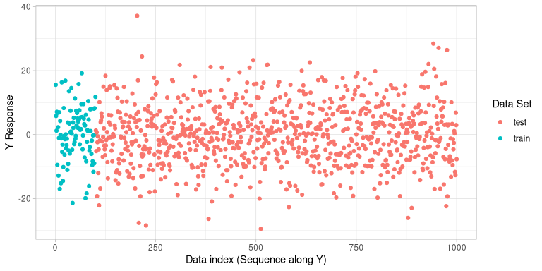
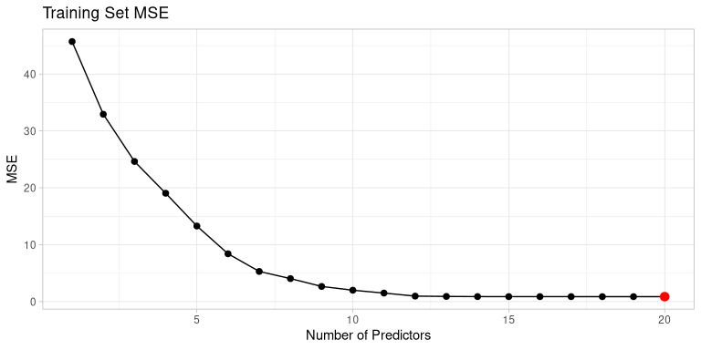
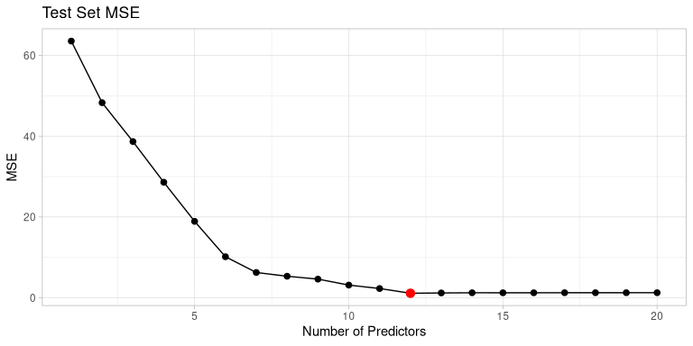
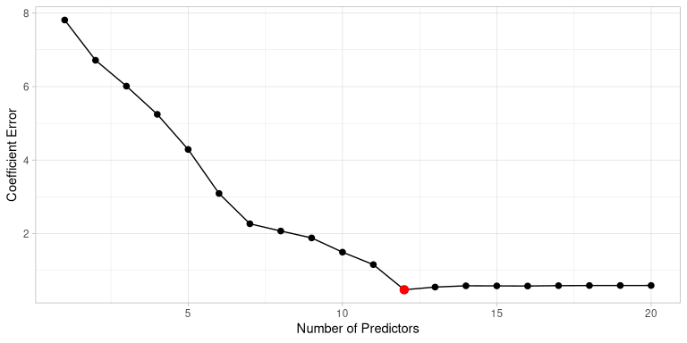

Chapter 6: Linear Model Selection and Regularisation
================
Alfredo Hernández -
10 April 2018

# Exercise 10

We have seen that as the number of features used in a model increases,
the training error will necessarily decrease, but the test error may
not. We will now explore this in a simulated data set.

1.  Generate a data set with *p* = 20 features, *n* = 1000 observations,
    and an associated quantitative response vector generated according
    to the model

*Y* = *X* ⋅ *β* + *ϵ*,

where *β* has some elements that are exactly equal to zero.

1.  Split your data set into a training set containing 100 observations
    and a test set containing 900 observations.

2.  Perform best subset selection on the training set, and plot the
    training set MSE associated with the best model of each size.

3.  Plot the test set MSE associated with the best model of each size.

4.  For which model size does the test set MSE take on its minimum
    value? Comment on your results. If it takes on its minimum value for
    a model containing only an intercept or a model containing all of
    the features, then play around with the way that you are generating
    the data in (a) until you come up with a scenario in which the test
    set MSE is minimized for an intermediate model size.

5.  How does the model at which the test set MSE is minimized compare to
    the true model used to generate the data? Comment on the coefficient
    values.

6.  Create a plot displaying
    $\\sqrt{\\sum\_{j=1}^{p}{(\\beta\_{j} -\\hat{\\beta}\_{j}^{r})}^{2}}$
    for a range of values of *r*, where *β̂*<sub>*j*</sub><sup>*r*</sup>
    is the *j*th coefficient estimate for the best model containing *r*
    coefficients. Comment on what you observe. How does this compare to
    the test MSE plot from (d)?

<!-- ## Answers -->

## Exercise 10 (a)

As usual, we start setting a seed to have consistent results:

``` r
set.seed(4)
```

First of all, we define the number of features *p* and the number of
observations *n*:

``` r
p <- 20
n <- 1000
```

We define now the set of predictors *X* and the random error:

``` r
X.mat <- matrix(rnorm(n * p), ncol = p)
epsilon <- rnorm(n)
```

We define a random *β* coefficients vector and set some of the
*β*<sub>*i*</sub> to be 0:

``` r
betas <- sample(-5:5, p, replace = T)
betas[sample(1:p, 6, replace = F)] <- 0
betas
```

    ##  [1] -3  1  3  0 -3  0 -1  0 -2  0  0  3  0 -5  0  1 -1  4  0  1

This is, we have a model with 12 non-zero variables.

Now we can easily define the *Y* response vector:

``` r
Y <- X.mat %*% betas + epsilon
```

Note that we use the inner product `%*%` for the matrix multiplication.

## Exercise 10 (b)

Now we split our `X.mat` data set into a training set containing 10% of
the observations, and a test set containing the remaining 90%:

``` r
train.ind <- sample(1:n, n * 0.1)
X.mat.train <- X.mat[train.ind, ]
X.mat.test <- X.mat[-train.ind, ]
```

Now we do the same for the *Y* response vector:

``` r
Y.train <- Y[train.ind, ]
Y.test <- Y[-train.ind, ]
train.df <- as_tibble(cbind(y = Y.train, X.mat.train))
```

    ## Warning: The `x` argument of `as_tibble.matrix()` must have unique column names if `.name_repair` is omitted as of tibble 2.0.0.
    ## Using compatibility `.name_repair`.
    ## This warning is displayed once every 8 hours.
    ## Call `lifecycle::last_warnings()` to see where this warning was generated.

``` r
test.df <- as_tibble(cbind(y = Y.test, X.mat.test))
```

We will change the names of the columns to ease the identification of
the parameters when analysing the different models:

``` r
names(train.df) <- c("y", paste0("β", 1:20))
names(test.df) <- c("y", paste0("β", 1:20))
```

Let us have a quick glance at the response *Y* as a scatter plot (just
ordered in sequential order):

``` r
ggplot(data = rbind(
  cbind(train.df, type = rep("train", nrow(train.df))),
  cbind(test.df, type = rep("test", nrow(test.df)))
)) +
  geom_point(aes(x = seq_along(y), y = y, colour = type)) +
  labs(x = "Data index (Sequence along Y)", y = "Y Response", colour = "Data Set")
```



## Exercise 10 (c)

We need the `leaps` package to use the `regsubsets()` function:

``` r
library(leaps)
```

To calculate the MSE, we will need to use the `regsubsets` method for
the `predict()` function:

``` r
predict.regsubsets <- function(object, newdata, id, ...) {
  form <- as.formula(object$call[[2]])
  mat <- model.matrix(form, newdata)
  coefi <- coef(object, id = id)
  xvars <- names(coefi)
  mat[, xvars] %*% coefi
}
```

Now we use `regsubsets()` to select best model for each size:

``` r
regfit.full <- regsubsets(y ~ ., data = train.df, nvmax = p)

err.full.train <- rep(NA, p)
for (i in 1:p) {
  pred.full <- predict(regfit.full, train.df, id = i)
  err.full.train[i] <- mean((train.df$y - pred.full)^2)
}
```

Let us see the training set MSE associated with the best model of each
size. We will use a custom `ggplot2` function:

``` r
plot_mse <- function(error) {
  error.df <- tibble(num = seq(1:length(error)), err = error)
  min.error.df <- error.df[which.min(error.df$err), ]
  ggplot(error.df) +
    aes(x = num, y = err) +
    geom_line() +
    geom_point(size = 2) +
    geom_point(data = min.error.df, colour = "red", size = 3) +
    labs(x = "Number of Predictors", y = "MSE")
}
```

Let us see the plot:

``` r
plot_mse(err.full.train) + labs(title = "Training Set MSE")
```



The minimum for train error should be at maximum predictor count:

``` r
which.min(err.full.train)
```

    ## [1] 20

## Exercise 10 (d)

Now we repeat the steps done previously, but now for the test set:

``` r
err.full.test <- rep(NA, p)
for (i in 1:p) {
  pred.full <- predict(regfit.full, test.df, id = i)
  err.full.test[i] <- mean((test.df$y - pred.full)^2)
}
```

Let us now see the test set MSE associated with the best model of each
size:

``` r
plot_mse(err.full.test) + labs(title = "Test Set MSE")
```



## Exercise 10 (e)

As expected, using the training data we get a model size that falls
between using a model with just the intercept or a model containing all
the features:

``` r
which.min(err.full.test)
```

    ## [1] 12

## Exercise 10 (f)

Let us now see the coefficients of the response selected by the test set
and compare them with the real model. For that, we will define a custom
function to create a data frame (which will be used also later on):

``` r
get_coef_df <- function(betas, coefs, sort.opt = T) {
  merge(tibble(beta = names(betas), betas),
    tibble(beta = names(coefs), coefs),
    all.x = T, sort = sort.opt
  )
}
```

The coefficients are:

``` r
coef.best <- coef(regfit.full, id = which.min(err.full.test))
names(betas) <- paste0("β", 01:20)

(coefs.df <- get_coef_df(betas, coef.best, F))
```

    ##    beta betas      coefs
    ## 1    β1    -3 -2.8281021
    ## 2    β2     1  1.0211359
    ## 3    β3     3  2.9416386
    ## 4    β5    -3 -2.8424928
    ## 5    β7    -1 -0.9349944
    ## 6    β9    -2 -1.8498252
    ## 7   β12     3  2.9090779
    ## 8   β14    -5 -4.9031922
    ## 9   β16     1  1.1329487
    ## 10  β17    -1 -1.1349930
    ## 11  β18     4  4.2255155
    ## 12  β20     1  0.8122513
    ## 13  β13     0         NA
    ## 14   β6     0         NA
    ## 15  β11     0         NA
    ## 16   β4     0         NA
    ## 17  β10     0         NA
    ## 18  β15     0         NA
    ## 19   β8     0         NA
    ## 20  β19     0         NA

As we can see, the best subset model successfully selected all the
correct predictors, i.e., the following *β*: β13, β6, β11, β4, β10, β15,
β8, β19.

## Exercise 10 (g)

Now we calculate the
$\\sqrt{\\sum\_{j=1}^{p}{(\\beta\_{j} -\\hat{\\beta}\_{j}^{r})}^{2}}$
error to analyse the difference between the real model and the best
model of each size:

``` r
err.coef <- rep(NA, p)
for (i in 1:p) {
  coef.i <- coef(regfit.full, id = i)
  df.err <- get_coef_df(betas, coef.i)
  df.err <- df.err %>%
    mutate(coefs = ifelse(is.na(coefs), 0, coefs))
  err.coef[i] <- sqrt(sum((df.err$betas - df.err$coefs)^2))
}
```

Let us see a plot of the coefficient error:

``` r
plot_mse(err.coef) + labs(y = "Coefficient Error")
```



As we can see, the coefficient error plot shows a very similar plot to
the test error plot, although the minimum value is more pronounced.
